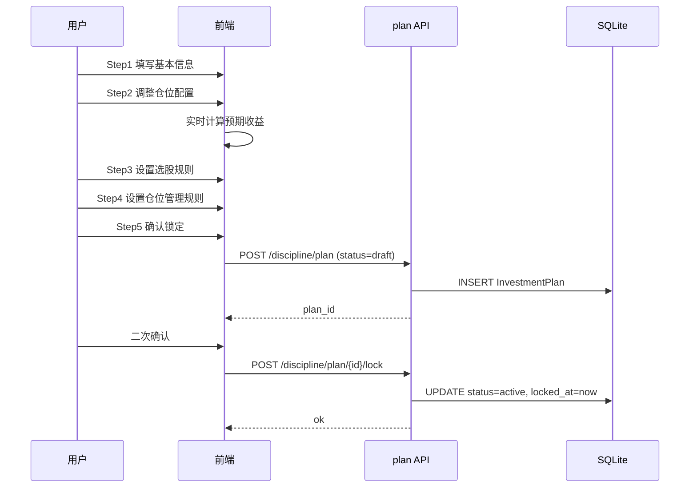
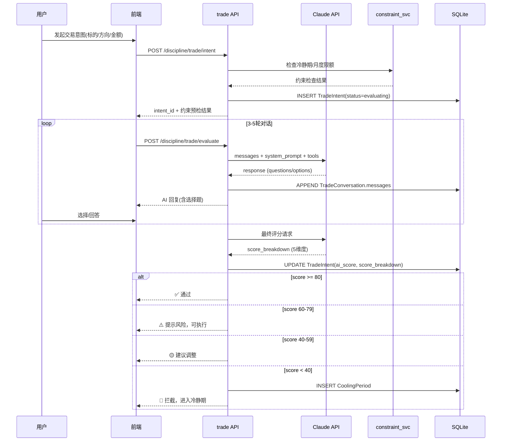
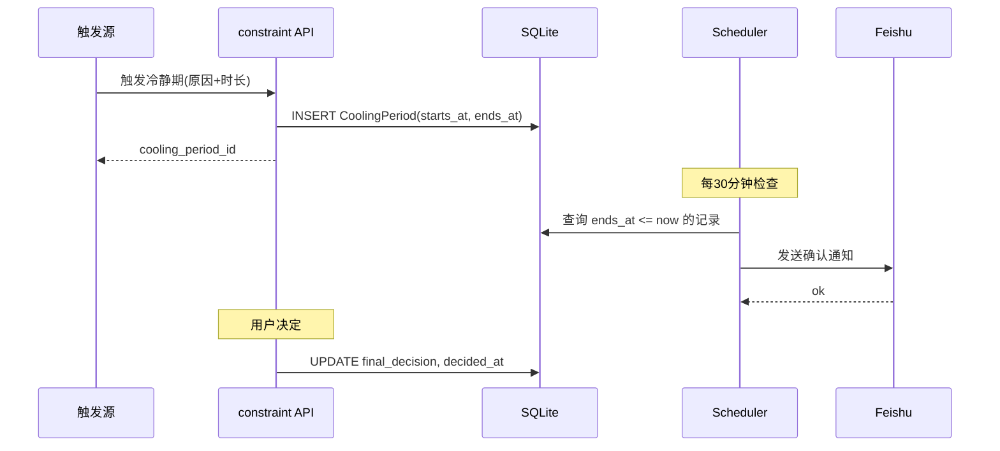
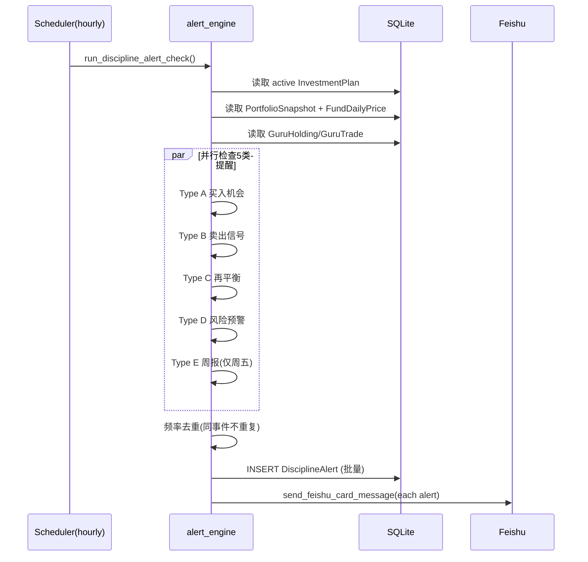

# 投资纪律系统 — 系统设计

> 需求: 投资纪律系统（PRD-投资纪律系统.md）
> 项目: BeFriend_FundAsset
> 日期: 2026-04-25
> FR 子项总数: 78（P0: 34, P1: 30, P2: 14）

---

## 1. 背景与目标

### 1.1 业务背景

散户亏损的核心原因是**行为失控**（追涨杀跌、频繁交易、重仓、恐慌割肉），而非选股能力不足。需要一套系统化的投资纪律执行工具，通过四层防护（计划→监控→决策→约束）帮助用户以 300 万本金实现年化 10% 收益。

### 1.2 设计目标

1. 在现有 BeFriend_FundAsset 项目上扩展，复用已有的 Portfolio/Strategy/Guru/Assistant/Notification 模块
2. 新增 `discipline/` 命名空间，包含 Plan/Alert/TradeEval/Constraint/Report 五个子模块
3. 覆盖 78 个功能子项（FR-PLAN/ALERT/EVAL/CONST/RPT/INFRA）

### 1.3 术语表

| 术语 | 说明 |
|------|------|
| 投资计划 (Plan) | 用户制定的包含目标、仓位配置、买卖规则的基准文件 |
| 冷静期 (Cooling Period) | 高风险操作触发后的强制等待时间 |
| 交易意图 (TradeIntent) | 用户发起的买/卖意向，需经 AI 评估 |
| 纪律评分 (Discipline Score) | AI 对交易意图的 0-100 分评估 |
| FR-XXX | 功能拆解编号，见 requirement-breakdown.md |

---

## 2. 整体方案

### 2.1 架构图

```
┌─────────────────────────────────────────────────────────────┐
│                     Frontend (React + Ant Design)           │
│  ┌──────────┐ ┌──────────┐ ┌──────────┐ ┌────────────────┐ │
│  │PlanWizard│ │AlertCenter│ │TradeEval │ │DisciplineReport│ │
│  │Dashboard │ │          │ │(Chat UI) │ │                │ │
│  └────┬─────┘ └────┬─────┘ └────┬─────┘ └───────┬────────┘ │
└───────┼─────────────┼───────────┼────────────────┼──────────┘
        │ axios       │           │                │
┌───────▼─────────────▼───────────▼────────────────▼──────────┐
│                   FastAPI Backend                            │
│                                                              │
│  api/discipline/                                             │
│  ┌──────┐ ┌──────┐ ┌──────┐ ┌──────────┐ ┌──────┐          │
│  │plan  │ │alert │ │trade │ │constraint│ │report│          │
│  └──┬───┘ └──┬───┘ └──┬───┘ └────┬─────┘ └──┬───┘          │
│     │        │        │          │           │              │
│  services/discipline/                                        │
│  ┌──────────┐ ┌────────────┐ ┌───────────────┐ ┌─────────┐ │
│  │plan_svc  │ │alert_engine│ │trade_evaluator│ │report_gen│ │
│  └──────────┘ └─────┬──────┘ └───────┬───────┘ └─────────┘ │
│                     │                │                       │
│  ┌──────────────────┼────────────────┼─────────────────────┐ │
│  │ Existing modules │                │                     │ │
│  │ ┌────────────┐ ┌─▼────────────┐ ┌▼──────────────────┐  │ │
│  │ │ portfolio  │ │ notification │ │ assistant (Claude) │  │ │
│  │ │ guru       │ │ (Feishu)     │ │ + new eval tools   │  │ │
│  │ │ strategy   │ └──────────────┘ └────────────────────┘  │ │
│  │ └────────────┘                                          │ │
│  └─────────────────────────────────────────────────────────┘ │
│                                                              │
│  scheduler/ ──► discipline_alert_check (hourly)              │
│               ► cooling_period_expiry (30min)                │
│               ► weekly_report (Fri 16:00)                    │
│               ► monthly_report (1st 08:00)                   │
│                                                              │
│  models/discipline/ ──► SQLite (8 new tables)                │
└──────────────────────────────────────────────────────────────┘
```

### 2.2 模块划分

| 模块 | 职责 | 覆盖 FR 编号 |
|------|------|-------------|
| Plan | 投资计划 CRUD、仓位配置、锁定/冷静期、仪表盘 | FR-PLAN-001~018 |
| Alert | 5 类提醒的触发、存储、展示、频率控制 | FR-ALERT-001~024 |
| TradeEval | 交易意图创建、AI 对话评估、评分、通过/拦截 | FR-EVAL-001~017 |
| Constraint | 冷静期管理、月度交易预算、情绪检测、写信机制 | FR-CONST-001~019 |
| Report | 周报/月报/季报生成与展示 | FR-RPT-001~015 |
| Infra | 数据模型、Claude API 集成、定时任务 | FR-INFRA-001~007 |

### 2.3 核心流程时序图

#### 2.3.1 计划创建流程



#### 2.3.2 交易评估流程



#### 2.3.3 冷静期流程



#### 2.3.4 提醒触发流程



---

## 3. 详细设计

### 3.1 数据模型（8 个新表）

#### 3.1.1 investment_plan — 投资计划

> 覆盖: FR-PLAN-001~013

| 字段 | 类型 | 默认值 | 说明 |
|------|------|--------|------|
| id | Integer PK | auto | 主键 |
| principal | Float | - | 本金总额 |
| annual_target | Float | 0.10 | 年化目标(小数) |
| investment_period | String(20) | - | 投资周期: "3y"/"5y"/"long" |
| risk_tolerance | Float | - | 最大单月回撤百分比 |
| experience_level | String(20) | - | "beginner"/"intermediate"/"advanced" |
| asset_allocation | Text(JSON) | - | `[{type, name, ratio, expected_return}]` |
| buy_conditions | Text(JSON) | - | `[{field, operator, threshold, label}]` |
| sell_conditions | Text(JSON) | - | `[{field, operator, threshold, label}]` |
| position_rules | Text(JSON) | - | `{max_single_pct, buy_batches, buy_interval_days, sell_batches, sell_interval_days, monthly_trade_limit, min_cash_pct}` |
| panic_letter | Text | null | "未来的你"写信内容 (FR-CONST-017) |
| status | String(20) | "draft" | "draft"/"active"/"locked" |
| locked_at | String | null | 锁定时间 ISO |
| cooldown_until | String | null | 修改冷静期截止 ISO |
| created_at | String | now() | |
| updated_at | String | now() | |

**索引**: `ix_plan_status` (status)

#### 3.1.2 plan_revision_log — 计划修改历史

> 覆盖: FR-PLAN-012

| 字段 | 类型 | 默认值 | 说明 |
|------|------|--------|------|
| id | Integer PK | auto | |
| plan_id | Integer FK | - | → investment_plan.id |
| changed_fields | Text(JSON) | - | 变更字段列表 |
| old_values | Text(JSON) | - | 旧值 |
| new_values | Text(JSON) | - | 新值 |
| changed_at | String | now() | |

**索引**: `ix_revision_plan_id` (plan_id)

#### 3.1.3 discipline_alert — 纪律提醒

> 覆盖: FR-ALERT-001~024

| 字段 | 类型 | 默认值 | 说明 |
|------|------|--------|------|
| id | Integer PK | auto | |
| type | String(30) | - | "buy_opportunity"/"sell_signal"/"rebalance"/"risk_warning"/"weekly_review" |
| severity | String(10) | - | "green"/"orange"/"blue"/"red"/"gray" |
| title | String(200) | - | 提醒标题 |
| content | Text(JSON) | - | 提醒详情(触发原因/建议操作/相关数据) |
| trigger_conditions | Text(JSON) | - | 触发条件快照 |
| fund_code | String(20) | null | 关联标的(可为空) |
| status | String(20) | "unread" | "unread"/"read"/"acted"/"dismissed" |
| dedupe_key | String(100) | null | 去重键(同事件不重复 FR-ALERT-019) |
| created_at | String | now() | |

**索引**: `ix_alert_status` (status), `ix_alert_type` (type), `uq_alert_dedupe` UNIQUE (dedupe_key) WHERE dedupe_key IS NOT NULL

#### 3.1.4 trade_intent — 交易意图

> 覆盖: FR-EVAL-001~012, FR-INFRA-002

| 字段 | 类型 | 默认值 | 说明 |
|------|------|--------|------|
| id | Integer PK | auto | |
| plan_id | Integer FK | - | → investment_plan.id |
| fund_code | String(20) | - | 标的代码 |
| fund_name | String(100) | - | 标的名称 |
| direction | String(10) | - | "buy"/"sell" |
| amount | Float | - | 金额 |
| status | String(20) | "evaluating" | "evaluating"/"approved"/"rejected"/"cooling"/"executed"/"cancelled" |
| ai_score | Integer | null | 0-100 |
| score_breakdown | Text(JSON) | null | `{plan_consistency, valuation, position, motivation, discipline}` |
| constraint_check | Text(JSON) | null | 约束预检结果 |
| created_at | String | now() | |
| decided_at | String | null | 最终决定时间 |

**索引**: `ix_intent_status` (status), `ix_intent_plan` (plan_id)

#### 3.1.5 trade_conversation — 交易对话

> 覆盖: FR-EVAL-013~017

| 字段 | 类型 | 默认值 | 说明 |
|------|------|--------|------|
| id | Integer PK | auto | |
| intent_id | Integer FK | - | → trade_intent.id |
| messages | Text(JSON) | "[]" | `[{role, content, timestamp}]` |
| round_count | Integer | 0 | 对话轮数 |
| created_at | String | now() | |
| completed_at | String | null | |

**索引**: `ix_conv_intent` (intent_id)

#### 3.1.6 cooling_period — 冷静期

> 覆盖: FR-CONST-001~008, FR-INFRA-004

| 字段 | 类型 | 默认值 | 说明 |
|------|------|--------|------|
| id | Integer PK | auto | |
| intent_id | Integer FK | null | → trade_intent.id (交易冷静期) |
| plan_id | Integer FK | null | → investment_plan.id (计划修改冷静期) |
| reason | String(50) | - | "plan_modify"/"large_amount"/"low_score"/"full_position"/"excess_trades" |
| duration_hours | Integer | - | 冷静期时长(小时) |
| starts_at | String | now() | |
| ends_at | String | - | |
| original_action | Text(JSON) | - | 原始操作信息快照 |
| final_decision | String(20) | null | "proceed"/"adjust"/"cancel" |
| decided_at | String | null | |

**索引**: `ix_cooling_ends` (ends_at), `ix_cooling_intent` (intent_id)

#### 3.1.7 monthly_trade_stats — 月度交易统计

> 覆盖: FR-CONST-009~010

| 字段 | 类型 | 默认值 | 说明 |
|------|------|--------|------|
| id | Integer PK | auto | |
| year_month | String(7) | - | "2026-04" |
| trade_count | Integer | 0 | 本月已交易次数 |
| trade_limit | Integer | 8 | 月上限 |
| excess_count | Integer | 0 | 超额次数 |

**索引**: `uq_year_month` UNIQUE (year_month)

#### 3.1.8 discipline_report — 复盘报告

> 覆盖: FR-RPT-001~015

| 字段 | 类型 | 默认值 | 说明 |
|------|------|--------|------|
| id | Integer PK | auto | |
| type | String(20) | - | "weekly"/"monthly"/"quarterly" |
| period_start | String | - | 周期起始日 |
| period_end | String | - | 周期结束日 |
| content | Text(JSON) | - | 报告内容(按类型不同结构不同) |
| generated_at | String | now() | |

**索引**: `ix_report_type_period` (type, period_start)

---

### 3.2 接口设计

遵循现有项目规范：prefix `/api/v1/discipline/`，统一 `ok()/fail()` 响应。

#### 3.2.1 Plan API（/api/v1/discipline/plan）

| 方法 | 路径 | 说明 | FR 编号 | 幂等 |
|------|------|------|---------|------|
| POST | /plan | 创建计划(status=draft) | FR-PLAN-001~009,013 | plan_id 去重 |
| GET | /plan/{id} | 获取计划详情 | FR-PLAN-014~017 | - |
| PUT | /plan/{id} | 更新计划(需检查冷静期) | FR-PLAN-011,012 | - |
| POST | /plan/{id}/lock | 锁定计划(二次确认) | FR-PLAN-010,011 | 已锁定时幂等返回 |
| GET | /plan/{id}/dashboard | 仪表盘数据(含实际仓位偏离) | FR-PLAN-014~018 | - |
| GET | /plan/{id}/revisions | 修改历史列表 | FR-PLAN-012 | - |
| POST | /plan/{id}/recommend | 根据基本信息推荐配置 | FR-PLAN-003 | - |
| POST | /plan/{id}/panic-letter | 保存/更新写信内容 | FR-CONST-017~019 | - |

**POST /plan Request**:
```python
class PlanCreate(BaseModel):
    principal: float           # > 0
    annual_target: float       # 0-1
    investment_period: str     # "3y"/"5y"/"long"
    risk_tolerance: float      # 0-1
    experience_level: str      # "beginner"/"intermediate"/"advanced"
    asset_allocation: list[dict]
    buy_conditions: list[dict]
    sell_conditions: list[dict]
    position_rules: dict
```

**GET /plan/{id}/dashboard Response** (in `ok(data)`):
```python
class PlanDashboard(BaseModel):
    plan: PlanDetail
    portfolio_summary: dict       # 当前净值/收益率/年化
    allocation_status: list[dict] # [{type, planned_pct, actual_pct, deviation, status}]
    monthly_trades: dict          # {used, limit, remaining}
    next_rebalance_date: str | None
    days_running: int
```

#### 3.2.2 Alert API（/api/v1/discipline/alert）

| 方法 | 路径 | 说明 | FR 编号 |
|------|------|------|---------|
| GET | /alert | 提醒列表(分页+筛选) | FR-ALERT-022 |
| GET | /alert/{id} | 提醒详情 | FR-ALERT-023 |
| PUT | /alert/{id}/read | 标记已读 | FR-ALERT-024 |
| PUT | /alert/{id}/dismiss | 忽略提醒 | FR-ALERT-024 |
| GET | /alert/unread-count | 未读数量 | FR-ALERT-024 |
| POST | /alert/{id}/postpone | 推迟提醒(如再平衡推迟1周) | FR-ALERT-015 |

**GET /alert Query Params**: `type`, `status`, `page`, `page_size`

**POST /alert/{id}/postpone Request**:
```python
class AlertPostpone(BaseModel):
    days: int = 7  # 推迟天数，默认7天
```
逻辑：将该 alert 标记为 dismissed，同时创建一个新的 scheduler task 在 N 天后重新检查该条件。

#### 3.2.3 Trade API（/api/v1/discipline/trade）

| 方法 | 路径 | 说明 | FR 编号 | 幂等 |
|------|------|------|---------|------|
| POST | /trade/intent | 创建交易意图 | FR-EVAL-001 | 同标的同方向5分钟内去重 |
| POST | /trade/evaluate | 提交对话回复+获取AI响应 | FR-EVAL-004~006 | - |
| GET | /trade/intent/{id} | 获取意图详情+对话历史 | FR-EVAL-017 | - |
| POST | /trade/intent/{id}/confirm | 确认执行 | FR-EVAL-016 | 已确认时幂等 |
| POST | /trade/intent/{id}/cancel | 取消操作 | FR-EVAL-016 | 已取消时幂等 |
| GET | /trade/intents | 交易意图历史列表 | FR-EVAL-017 | - |

**POST /trade/intent Request**:
```python
class TradeIntentCreate(BaseModel):
    fund_code: str
    fund_name: str
    direction: Literal["buy", "sell"]
    amount: float  # > 0
```

**POST /trade/evaluate Request**:
```python
class TradeEvalRequest(BaseModel):
    intent_id: int
    user_message: str  # 用户回复(选项字母或自由文本)
```

**Response** (in `ok(data)`):
```python
class TradeEvalResponse(BaseModel):
    ai_message: str
    options: list[dict] | None  # [{label, value}] 选择题选项
    is_complete: bool           # 对话是否结束
    score: int | None           # 评分(仅is_complete=True时)
    score_breakdown: dict | None
    result: str | None          # "approved"/"warning"/"adjust"/"rejected"
```

#### 3.2.4 Constraint API（/api/v1/discipline/constraint）

| 方法 | 路径 | 说明 | FR 编号 |
|------|------|------|---------|
| GET | /constraint/cooling | 当前生效的冷静期列表 | FR-CONST-006 |
| GET | /constraint/cooling/{id} | 冷静期详情+倒计时 | FR-CONST-006 |
| POST | /constraint/cooling/{id}/decide | 冷静期结束后决定 | FR-CONST-007 |
| GET | /constraint/monthly-stats | 本月交易统计 | FR-CONST-009 |
| POST | /constraint/emotion-check | 情绪信号检测 | FR-CONST-011~016 |

**POST /constraint/emotion-check Request**:
```python
class EmotionCheckRequest(BaseModel):
    intent_text: str        # 用户原始输入
    amount: float           # 操作金额
    fund_code: str | None
```

**Response**:
```python
class EmotionCheckResponse(BaseModel):
    signals: list[dict]     # [{type, weight, description}]
    signal_count: int
    triggered: bool         # >= 2 signals
    cooling_period_id: int | None  # 如果触发了冷静期
```

#### 3.2.5 Report API（/api/v1/discipline/report）

| 方法 | 路径 | 说明 | FR 编号 |
|------|------|------|---------|
| GET | /report | 报告列表(按类型筛选) | FR-RPT-014 |
| GET | /report/{id} | 报告详情 | FR-RPT-015 |
| POST | /report/generate | 手动触发生成报告 | FR-RPT-001~013 |

#### 报告内容结构设计

> 覆盖: FR-RPT-001~013

**周报 content JSON** (FR-RPT-001~003):
```python
{
    "portfolio_return_week": float,     # 本周收益率
    "portfolio_return_month": float,    # 本月收益率
    "plan_progress": float,            # 年化折算 vs 目标
    "trade_count": int,                # 本周交易次数
    "trades": [{"fund", "direction", "amount", "score"}],
    "blocked_trades": [{"fund", "direction", "amount", "score", "reason"}],  # 被拦截操作
    "no_trade_days": int,              # 未交易天数（"没操作也是成绩"）
    "no_trade_message": str            # 鼓励性消息
}
```

**月报 content JSON** (FR-RPT-004~008):
```python
{
    "portfolio_return": float,          # 月度收益
    "benchmark_return": float,          # 基准收益(沪深300/标普500各50%)
    "excess_return": float,             # 超额收益
    "trade_count": int,                 # 月操作次数
    "trade_limit": int,                 # 计划上限
    "excess_trade_count": int,          # 超额交易次数(FR-CONST-010醒目标注)
    "blocked_trades_performance": [     # 被拦截操作事后表现(FR-RPT-006, P2)
        {"fund", "direction", "blocked_price", "current_price", "hypothetical_pnl"}
    ],
    "plan_execution_score": float,      # 计划执行得分(FR-RPT-007)
    "guru_updates": [{"guru_name", "action", "stock", "date"}]  # 大师动态(FR-RPT-008)
}
```

**季报 content JSON** (FR-RPT-009~013, P2):
```python
{
    "quarterly_return": float,
    "annualized_return": float,         # FR-RPT-009
    "allocation_deviation": [           # FR-RPT-010
        {"type", "planned_pct", "actual_pct", "deviation"}
    ],
    "rebalance_history": [...],         # FR-RPT-011
    "blocked_simulation": [...],        # FR-RPT-012 "如果执行了"模拟
    "next_quarter_suggestions": [str]   # FR-RPT-013
}
```

#### 预期收益计算公式 (FR-PLAN-004)

```
expected_annual_return = Σ(allocation[i].ratio × allocation[i].expected_return_mid)

其中 expected_return_mid = (expected_return_low + expected_return_high) / 2
```

前端滑块调整 ratio 时，实时重算此公式并展示。

#### 计划字段校验规则 (FR-PLAN-002, 005, 009)

```python
class PlanValidation:
    principal: float          # > 0, <= 100_000_000
    annual_target: float      # > 0, <= 1.0 (100%)
    risk_tolerance: float     # > 0, <= 0.5 (50%)

    # asset_allocation 校验
    allocation_sum: float     # == 1.0 (允许 ±0.001 浮点误差)
    allocation_item_ratio: float  # >= 0, <= 1.0 each

    # position_rules 校验
    max_single_pct: float     # > 0, <= 1.0
    buy_batches: int          # >= 1, <= 10
    buy_interval_days: int    # >= 1
    sell_batches: int         # >= 1, <= 10
    sell_interval_days: int   # >= 1
    monthly_trade_limit: int  # >= 1, <= 50
    min_cash_pct: float       # >= 0, <= 1.0
```

校验在 Pydantic schema 层通过 `@field_validator` 实现，API 层通过 422 返回校验错误详情。

#### 空状态处理 (FR-PLAN-018)

```
GET /discipline/plan/current
  → 无 active 计划时返回: ok(data=None, meta={"has_plan": false})
  → 前端根据 has_plan=false 展示引导创建计划的 Empty 组件
```

#### P2 延后设计说明 (FR-INFRA-005, FR-INFRA-006)

以下功能为 P2 优先级，本期**不设计实现方案**，仅预留扩展点：

- **FR-INFRA-005 券商 API 接入**：当前 PortfolioRecord 为手动/导入更新。未来可新增 `BrokerAdapter` 接口，通过定时任务同步真实持仓。InvestmentPlan 和 TradeIntent 的数据结构已兼容。
- **FR-INFRA-006 移动端推送**：当前通过 Feishu webhook 通知。未来可在 `notification/` 下新增 `push_service.py`，DisciplineAlert 模型已包含所需信息。

---

### 3.6 Claude API 降级方案

> 解决架构评审 HIGH: 无 Claude API fallback

当 Claude API 不可用时（超时/5xx/配额耗尽）：

1. **TradeIntent 标记为 `ai_unavailable`**，不卡在 `evaluating` 状态
2. **提供手动旁路**：用户可选择"跳过 AI 评估，手动确认"
   - 手动确认时 ai_score 记为 null，备注 "manual_bypass"
   - 仍然执行约束检查（冷静期/月度限额/仓位上限）
3. **重试策略**：timeout=30s，最多重试 1 次，间隔 2s

```python
# POST /trade/evaluate 增加 fallback 参数
class TradeEvalRequest(BaseModel):
    intent_id: int
    user_message: str
    manual_bypass: bool = False  # AI 不可用时手动旁路
```

### 3.7 TradeEval 速率限制

> 解决架构评审 MEDIUM: 缺少速率限制

复用现有 assistant 的速率限制模式：

```python
# 内存计数器，10 requests/min per endpoint
trade_eval_limiter = InMemoryRateLimiter(max_requests=10, window_seconds=60)
```

### 3.8 Prompt 注入防护

> 解决架构评审 MEDIUM: user_message 注入风险

1. `user_message` 长度限制 500 字符
2. AI 返回的 score 由 `finalize_evaluation` tool 生成，服务端校验 0-100 范围
3. 评分结果不信任 AI 的自由文本，只信任 tool 返回的结构化数据

---

### 3.3 AI 对话引擎

> 覆盖: FR-EVAL-004~006, FR-INFRA-007

#### 扩展方式

在现有 `services/assistant/` 基础上，新增 `services/discipline/trade_evaluator.py`，不修改现有 assistant 代码。

#### System Prompt

```python
TRADE_EVAL_SYSTEM_PROMPT = """
你是一位理性的投资纪律守护者。用户想要执行一笔交易，你的任务是：
1. 检查这笔交易是否符合用户的投资计划
2. 评估估值是否合理
3. 通过3-5轮对话了解用户的交易动机
4. 给出0-100分的综合评分

评分维度：
- 计划一致性(30%): 是否符合投资计划中的买卖规则
- 估值合理性(20%): PE/PB/评分是否在合理区间
- 仓位控制(20%): 是否违反单票/现金仓位限制
- 动机理性(20%): 买入原因是否基于分析而非情绪
- 执行纪律(10%): 是否分批、是否在计划时间点

对话风格：
- 温和但坚定，像一个理性的朋友
- 提供选择题降低用户输入成本
- 检测到冲动信号时温和提醒
- 最终给出明确评分和建议

当你完成评估时，使用 finalize_evaluation 工具返回结构化评分。
"""
```

#### 新增 Tools

```python
TRADE_EVAL_TOOLS = [
    {
        "name": "get_plan_status",
        "description": "获取当前投资计划的状态(仓位配置/规则/当前持仓)",
        # 返回: plan + portfolio_summary + allocation_status
    },
    {
        "name": "check_trade_constraints",
        "description": "检查交易约束(冷静期/月度限额/仓位上限)",
        # 输入: fund_code, direction, amount
        # 返回: constraint violations list
    },
    {
        "name": "get_fund_valuation",
        "description": "获取标的估值数据(PE/评分/大师持仓)",
        # 输入: fund_code
        # 返回: valuation metrics + guru signals
    },
    {
        "name": "get_trade_history",
        "description": "获取近期交易意图历史",
        # 返回: recent 10 trade intents with scores
    },
    {
        "name": "finalize_evaluation",
        "description": "完成评估，返回结构化评分",
        # 输入: plan_consistency, valuation, position, motivation, discipline, summary
        # 返回: total_score, result(approved/warning/adjust/rejected)
    }
]
```

#### 调用参数

- model: `claude-sonnet-4-20250514`（与现有 assistant 一致）
- max_tokens: 2048
- max_rounds: 5（现有 assistant 是 3，这里增加到 5）
- temperature: 0（评分需要稳定性）
- timeout: 30s（含重试 1 次）

---

### 3.4 提醒引擎

> 覆盖: FR-ALERT-001~021

复用现有 `services/strategy/evaluator.py` 的条件引擎模式。

#### 5 类提醒触发逻辑

| 类型 | 触发频率 | 逻辑 | 数据源 |
|------|----------|------|--------|
| A 买入机会 | hourly, 每周≤2条 | AND: 目标股+价格低于GF Value 80%+大师买入+仓位未达上限+现金>5% | FundDailyPrice + GuruTrade + PortfolioRecord |
| B 卖出信号 | hourly, 即时 | OR: 涨幅+50%/PE>90分位/3大师减持/ROE下降2季/权重>15% | FundDailyPrice + GuruTrade + PortfolioRecord |
| C 再平衡 | 每季度 | 季度日期到达 OR 仓位偏离>5% | PortfolioSnapshot + InvestmentPlan |
| D 风险预警 | hourly, 同事件不重复 | 单日回撤>3% OR 月度回撤>8% | PortfolioSnapshot |
| E 周报 | 每周五16:00 | 固定时间 | 全部数据 |

#### 去重机制

`dedupe_key` = `{type}:{fund_code}:{date}` 或 `{type}:{period}`

相同 dedupe_key 不重复插入（UNIQUE 约束），确保 FR-ALERT-019。

#### Feishu 通知集成

复用现有 `send_feishu_card_message()`，按类型设置不同 header template:
- A 绿色: `template="green"`
- B 橙色: `template="orange"`
- C 蓝色: `template="blue"`
- D 红色: `template="red"`
- E 灰色: `template="grey"`

---

### 3.5 定时任务

> 覆盖: FR-INFRA 相关

| Job | 频率 | 职责 |
|-----|------|------|
| `job_discipline_alert_check` | 每小时(交易时段) | 运行提醒引擎，检查 5 类提醒条件 |
| `job_cooling_period_expiry` | 每 30 分钟 | 检查到期冷静期，发送确认通知 |
| `job_weekly_discipline_report` | 每周五 16:00 | 生成周报(FR-RPT-001~003) |
| `job_monthly_discipline_report` | 每月 1 日 08:00 | 生成月报(FR-RPT-004~008) |

遵循现有 `@_record_run("job_id")` 装饰器模式，每个 job 创建独立 DB session。

---

## 4. 非功能设计

### 4.1 Claude API 调用成本控制

- 每次交易评估限制 max_rounds=5，max_tokens=2048
- 使用 structured output（finalize_evaluation tool）减少 token 浪费
- 通过 SystemConfig 配置 `trade_eval_model` 和 `trade_eval_max_rounds`，可降级到更便宜的模型
- 报告生成不使用 AI（纯数据聚合），节省成本

### 4.2 SQLite 并发写入

- 单用户场景，WAL 模式已启用，写竞争风险低
- Scheduler jobs 和 API 请求使用独立 session，短事务
- 无需额外并发控制

---

## 5. 兼容性与发布

### 5.1 与现有模块的集成

| 现有模块 | 集成方式 | 影响 |
|----------|----------|------|
| portfolio | 读取 PortfolioRecord/Snapshot 计算仓位偏离 | 只读，无影响 |
| guru | 读取 GuruHolding/Trade 作为提醒信号 | 只读，无影响 |
| assistant | 新增独立 trade_evaluator，不修改现有 assistant | 无影响 |
| notification | 复用 send_feishu_card_message() | 无影响 |
| scheduler | 新增 4 个 job 到 setup.py | 追加，无影响 |
| diary | panic_letter 存在 InvestmentPlan 表，不修改 Diary | 无影响 |

### 5.2 数据迁移

纯新增 8 张表，无需数据迁移。表在应用启动时通过 `Base.metadata.create_all()` 自动创建。

### 5.3 新增 SystemConfig 键

| Key | Default | 说明 |
|-----|---------|------|
| discipline_enabled | "true" | 总开关 |
| trade_eval_model | "claude-sonnet-4-20250514" | AI 评估模型 |
| trade_eval_max_rounds | "5" | 最大对话轮数 |
| cooling_period_plan_hours | "48" | 计划修改冷静期 |
| cooling_period_trade_hours | "24" | 交易冷静期 |
| monthly_trade_limit | "8" | 月交易上限 |

---

## 6. 风险与应对

| # | 风险 | 级别 | 应对 |
|---|------|------|------|
| R1 | 无交易模型 | HIGH | 新增 TradeIntent 模型作为核心交易记录 |
| R2 | 无估值数据(PE/ROE) | MEDIUM | 暂从 GuruFocus 数据间接获取；后续可扩展 FundValuation 模型 |
| R3 | 单用户假设 | LOW | 当前不影响，未来扩展时加 user_id 字段 |
| R4 | SQLite 写竞争 | LOW | 单用户 + WAL 模式足够 |
| R5 | Claude API 成本 | MEDIUM | 限制轮数 + 可配置模型 + 报告不用 AI |
| R6 | Alert 系统重叠 | MEDIUM | discipline_alert 与 alert_log 完全独立，不互相影响 |
| R7 | 无 Alembic 迁移 | LOW | 纯新增表用 create_all() 即可；字段变更时手动 ALTER |
| R8 | JSON Text 列 | LOW | 遵循现有模式；需 SQL 过滤的字段用独立列 |

---

## 7. 排期估算

| 阶段 | 内容 | 预估 |
|------|------|------|
| P0 后端 | 数据模型 + Plan/Trade/Constraint API + AI 评估引擎 | - |
| P0 前端 | PlanWizard + Dashboard + TradeEval Chat UI | - |
| P1 后端 | Alert 引擎 + Report 生成 + 情绪检测 + 定时任务 | - |
| P1 前端 | AlertCenter + Reports + 写信机制 | - |
| P2 | 被拦截模拟 + 数据同步 + 券商 API + 季报 | - |

---

## 8. 附录

### 8.1 代码阅读报告

→ [code-reading-report.md](code-reading-report.md)

### 8.2 FR 覆盖矩阵

| 设计章节 | 覆盖 FR 编号 |
|----------|-------------|
| §3.1.1 investment_plan | FR-PLAN-001~013, FR-CONST-017 |
| §3.1.3 discipline_alert | FR-ALERT-001~024 |
| §3.1.4 trade_intent | FR-EVAL-001~012, FR-INFRA-002 |
| §3.1.5 trade_conversation | FR-EVAL-013~017 |
| §3.1.6 cooling_period | FR-CONST-001~008, FR-INFRA-004 |
| §3.1.7 monthly_trade_stats | FR-CONST-009~010 |
| §3.1.8 discipline_report | FR-RPT-001~015 |
| §3.2.1 Plan API | FR-PLAN-001~018 |
| §3.2.2 Alert API | FR-ALERT-022~024 |
| §3.2.3 Trade API | FR-EVAL-001~017 |
| §3.2.4 Constraint API | FR-CONST-001~019 |
| §3.2.5 Report API | FR-RPT-014~015 |
| §3.3 AI 引擎 | FR-EVAL-004~006, FR-INFRA-007 |
| §3.4 提醒引擎 | FR-ALERT-001~021 |
| §3.5 定时任务 | FR-INFRA-003 |
| §5.3 SystemConfig | FR-INFRA-007 |
