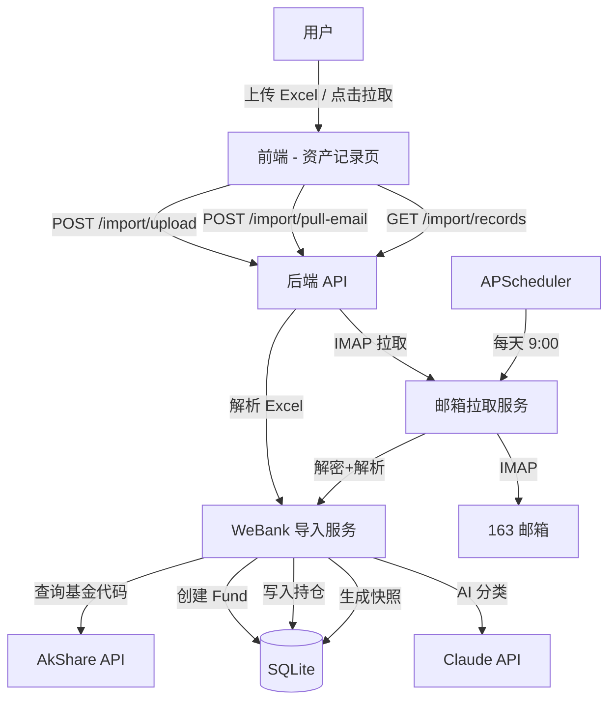
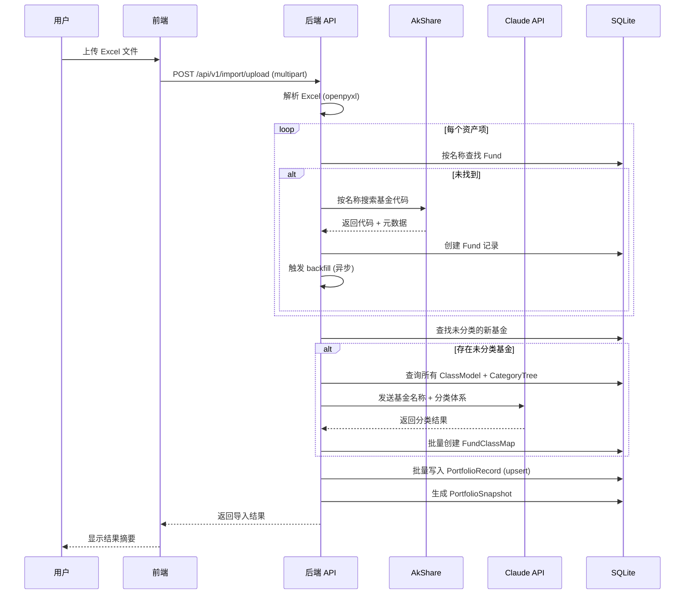
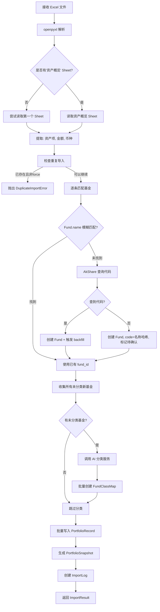
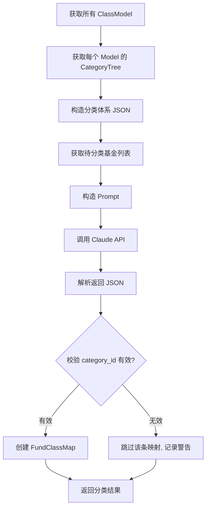
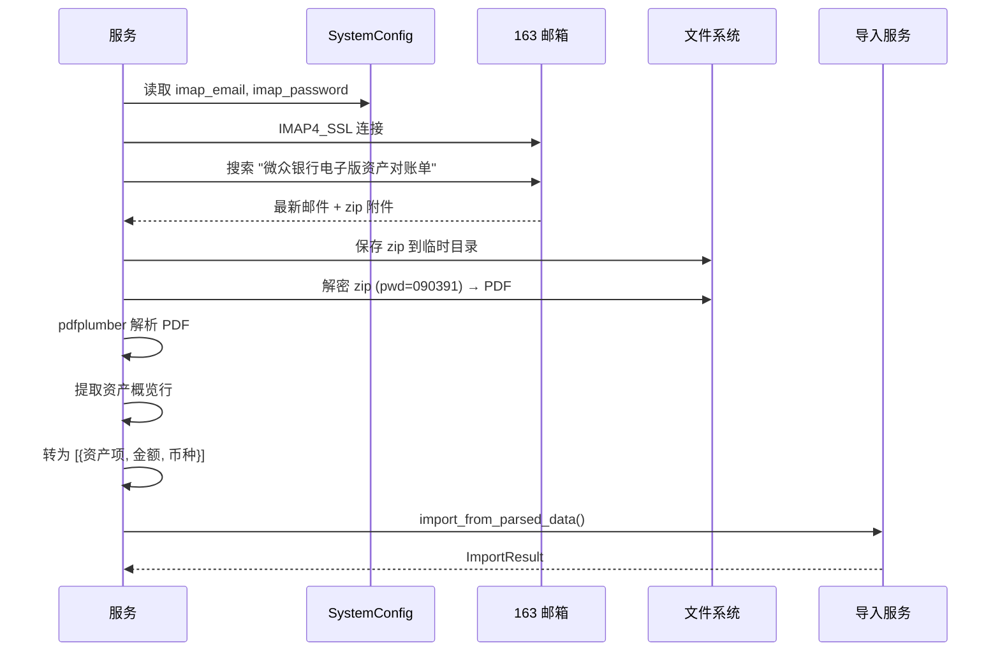
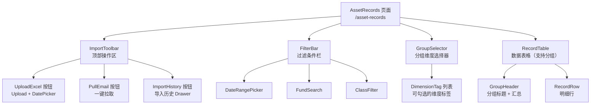
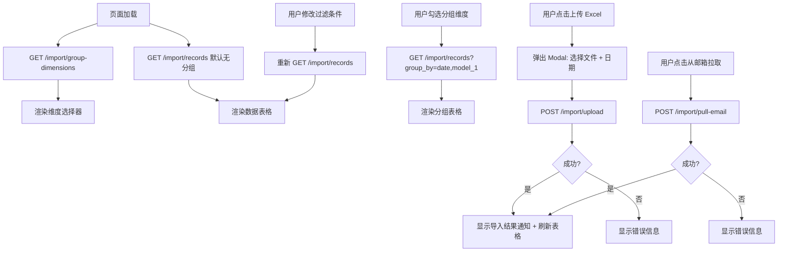
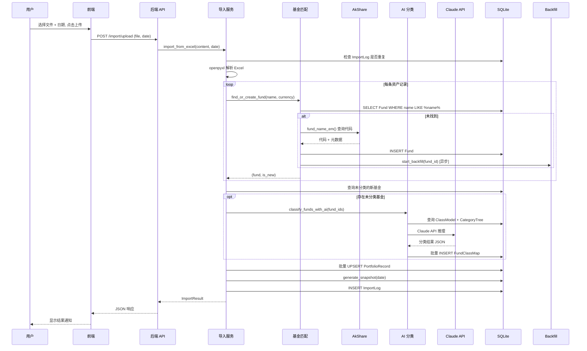

# 微众银行资产数据导入与自动分类 - 技术设计文档

## 1. 架构概览

### 1.1 系统上下文图



### 1.2 核心数据流



---

## 2. 后端设计

### 2.1 新增模型：ImportLog（导入日志）

用于防重复导入和追溯导入历史。

**文件**：`backend/app/models/import_log.py`（新增）

```python
from sqlalchemy import Column, Date, DateTime, Integer, String, Text
from datetime import datetime
from app.database import Base


class ImportLog(Base):
    __tablename__ = "import_logs"

    id = Column(Integer, primary_key=True, autoincrement=True)
    import_date = Column(Date, nullable=False, index=True)  # 对账单日期
    source = Column(String(20), nullable=False)  # "excel_upload" | "email_pull"
    file_name = Column(String(200), nullable=False)  # 原始文件名
    record_count = Column(Integer, nullable=False, default=0)  # 导入记录数
    new_funds_count = Column(Integer, nullable=False, default=0)  # 新建基金数
    status = Column(String(20), nullable=False, default="success")  # success | error
    error_message = Column(Text, nullable=True)
    created_at = Column(DateTime, nullable=False, default=datetime.utcnow)
```

### 2.2 models/__init__.py 注册

**文件**：`backend/app/models/__init__.py`（修改）

在现有 import 列表末尾新增：
```python
from app.models.import_log import ImportLog  # noqa: F401
```

### 2.3 API 接口设计

**文件**：`backend/app/api/import_data.py`（新增）

#### 2.3.1 POST /api/v1/import/upload

上传 Excel 文件并执行全流程导入。

```python
@router.post("/upload")
async def upload_excel(
    file: UploadFile = File(...),
    record_date: date = Query(..., description="持仓日期，如 2026-04-17"),
    db: Session = Depends(get_db),
) -> dict:
```

**请求**：
- Content-Type: `multipart/form-data`
- `file`: xlsx 文件
- `record_date`: query param，持仓记录日期

**响应**：
```json
{
  "success": true,
  "data": {
    "total_items": 35,
    "matched_funds": 30,
    "new_funds_created": 5,
    "records_imported": 35,
    "classification_results": {
      "classified": 5,
      "models_covered": 3
    },
    "snapshot_generated": true,
    "import_log_id": 1
  }
}
```

**错误码**：
- 400: 文件格式不正确 / 缺少必要列
- 409: 该日期已有导入记录（可通过 `force=true` 覆盖）
- 500: 内部错误

#### 2.3.2 POST /api/v1/import/pull-email

从 163 邮箱拉取最新对账单并执行全流程导入。

```python
@router.post("/pull-email")
async def pull_email(
    db: Session = Depends(get_db),
) -> dict:
```

**请求**：无参数（凭据从 SystemConfig 读取）

**响应**：
```json
{
  "success": true,
  "data": {
    "email_found": true,
    "statement_date": "2026-04-17",
    "total_items": 35,
    "matched_funds": 30,
    "new_funds_created": 5,
    "records_imported": 35,
    "import_log_id": 2
  }
}
```

**错误码**：
- 400: IMAP 凭据未配置
- 404: 未找到新的对账单邮件
- 409: 最新对账单已导入
- 500: IMAP 连接失败

#### 2.3.3 GET /api/v1/import/records

查询资产记录（支持过滤和分组）。

```python
@router.get("/records")
def list_import_records(
    start_date: date | None = Query(default=None),
    end_date: date | None = Query(default=None),
    fund_id: int | None = Query(default=None),
    keyword: str = Query(default=""),
    model_id: int | None = Query(default=None),
    category_id: int | None = Query(default=None),
    group_by: str | None = Query(default=None, description="逗号分隔的分组维度: date,model_<id>,currency"),
    db: Session = Depends(get_db),
) -> dict:
```

**分组逻辑**：
- `group_by` 为空时返回明细列表
- `group_by=date` 按 record_date 分组
- `group_by=model_3` 按 ClassModel id=3 的分类分组
- `group_by=date,model_3` 按日期+分类交叉分组
- `group_by=currency` 按币种分组

**响应（分组模式）**：
```json
{
  "success": true,
  "data": {
    "groups": [
      {
        "key": {"date": "2026-04-17", "model_3": "美股"},
        "total_amount": 150000.00,
        "total_amount_cny": 150000.00,
        "total_profit": 5000.00,
        "count": 5,
        "records": [...]
      }
    ],
    "summary": {
      "total_amount_cny": 1200000.00,
      "total_profit": 30000.00,
      "record_count": 35
    }
  }
}
```

**响应（明细模式）**：
```json
{
  "success": true,
  "data": [
    {
      "id": 1,
      "fund_id": 1,
      "fund_code": "005561",
      "fund_name": "天弘标普500发起(QDII-FOF)A",
      "record_date": "2026-04-17",
      "amount": 120344.25,
      "amount_cny": 120344.25,
      "profit": 5000.00,
      "currency": "CNY",
      "classifications": {
        "资产类别": "权益-美股",
        "投资区域": "美国"
      }
    }
  ],
  "meta": {
    "total": 35,
    "summary": {
      "total_amount_cny": 1200000.00,
      "total_profit": 30000.00
    }
  }
}
```

#### 2.3.4 GET /api/v1/import/logs

查询导入历史日志。

```python
@router.get("/logs")
def list_import_logs(
    limit: int = Query(default=20),
    db: Session = Depends(get_db),
) -> dict:
```

#### 2.3.5 GET /api/v1/import/group-dimensions

获取可用的分组维度列表。

```python
@router.get("/group-dimensions")
def get_group_dimensions(db: Session = Depends(get_db)) -> dict:
```

**响应**：
```json
{
  "success": true,
  "data": [
    {"key": "date", "label": "日期（精确）", "type": "date"},
    {"key": "date_week", "label": "日期（周）", "type": "date"},
    {"key": "date_month", "label": "日期（月）", "type": "date"},
    {"key": "currency", "label": "币种", "type": "enum"},
    {"key": "model_1", "label": "资产类别", "type": "classification"},
    {"key": "model_2", "label": "投资区域", "type": "classification"},
    {"key": "model_3", "label": "投资策略", "type": "classification"}
  ]
}
```

### 2.4 路由注册

**文件**：`backend/app/main.py`（修改）

在现有路由注册处（约第 20-30 行区域）新增：
```python
from app.api.import_data import router as import_router
app.include_router(import_router, prefix="/api/v1/import", tags=["import"])
```

### 2.5 Pydantic Schema

**文件**：`backend/app/schemas/import_data.py`（新增）

```python
from datetime import date, datetime
from pydantic import BaseModel


class ImportResultResponse(BaseModel):
    total_items: int
    matched_funds: int
    new_funds_created: int
    records_imported: int
    classification_results: dict
    snapshot_generated: bool
    import_log_id: int


class EmailPullResultResponse(BaseModel):
    email_found: bool
    statement_date: str | None
    total_items: int
    matched_funds: int
    new_funds_created: int
    records_imported: int
    import_log_id: int


class ImportLogResponse(BaseModel):
    id: int
    import_date: date
    source: str
    file_name: str
    record_count: int
    new_funds_count: int
    status: str
    error_message: str | None
    created_at: datetime

    class Config:
        from_attributes = True


class ImportRecordResponse(BaseModel):
    id: int
    fund_id: int
    fund_code: str
    fund_name: str
    record_date: date
    amount: float
    amount_cny: float
    profit: float
    currency: str
    classifications: dict  # {model_name: category_name}

    class Config:
        from_attributes = True


class GroupedResult(BaseModel):
    key: dict
    total_amount: float
    total_amount_cny: float
    total_profit: float
    count: int
    records: list[ImportRecordResponse]


class GroupDimension(BaseModel):
    key: str
    label: str
    type: str  # "date" | "enum" | "classification"
```

### 2.6 业务逻辑服务

#### 2.6.1 WeBank 导入服务

**文件**：`backend/app/services/webank/importer.py`（新增）

```python
def import_from_excel(
    db: Session,
    file_content: bytes,
    file_name: str,
    record_date: date,
    force: bool = False,
) -> ImportResult:
    """
    全流程导入：解析 Excel → 匹配/创建基金 → AI 分类 → 写入持仓 → 生成快照

    Args:
        db: 数据库 session
        file_content: Excel 文件二进制内容
        file_name: 原始文件名
        record_date: 持仓记录日期
        force: 是否强制覆盖已有数据

    Returns:
        ImportResult 包含导入统计信息

    Raises:
        ValueError: 文件格式错误
        DuplicateImportError: 该日期已有导入记录（且 force=False）
    """
```

核心流程：



#### 2.6.2 AkShare 基金代码查询

**文件**：`backend/app/services/webank/fund_matcher.py`（新增）

```python
def match_fund_by_name(db: Session, fund_name: str) -> Fund | None:
    """
    按名称在数据库中模糊匹配基金。
    匹配策略：
    1. 精确匹配 Fund.name
    2. 去除份额后缀(A/B/C/E)后匹配
    3. 包含匹配（name LIKE %keyword%）
    """

def lookup_fund_code_via_akshare(fund_name: str) -> dict | None:
    """
    通过 AkShare 的 fund_name_em() 接口查询基金代码。

    Args:
        fund_name: 基金名称（如 "天弘标普500发起(QDII-FOF)A"）

    Returns:
        {"code": "005918", "name": "天弘标普500...", "type": "混合型-FOF"} 或 None

    实现：
        import akshare as ak
        df = ak.fund_name_em()  # 获取全部基金列表（有缓存）
        # 在 df 中按名称模糊搜索
    """

def find_or_create_fund(
    db: Session,
    fund_name: str,
    currency: str = "CNY",
) -> tuple[Fund, bool]:
    """
    查找或创建基金。返回 (fund, is_new)。
    1. 先在 DB 中按名称匹配
    2. 匹配不到则通过 AkShare 查代码
    3. 查到代码则创建 Fund（data_source=akshare）
    4. 查不到代码则创建 Fund（code 用名称前6字符拼音首字母+随机数，标记 is_active=False）
    """
```

#### 2.6.3 AI 分类服务

**文件**：`backend/app/services/webank/classifier.py`（新增）

```python
def classify_funds_with_ai(
    db: Session,
    fund_ids: list[int],
) -> dict[int, dict[int, int]]:
    """
    使用 Claude API 为基金自动分类。

    Args:
        db: 数据库 session
        fund_ids: 待分类的基金 ID 列表

    Returns:
        {fund_id: {model_id: category_id}} 分类映射

    实现流程：
    1. 查询所有 ClassModel 及其 ClassCategory 树
    2. 查询待分类基金的名称
    3. 构造 prompt，发送给 Claude API
    4. 解析 AI 返回的 JSON
    5. 验证 category_id 存在性
    6. 批量创建 FundClassMap
    """
```

**Claude API Prompt 模板**：

```python
CLASSIFICATION_PROMPT = """
你是一个基金分类专家。请根据基金名称，为每个基金在每个分类模型下选择最合适的分类。

## 分类体系

{classification_tree}

## 待分类基金

{fund_list}

## 输出格式

请以 JSON 格式返回，格式如下：
```json
[
  {
    "fund_id": 1,
    "fund_name": "...",
    "classifications": [
      {"model_id": 1, "model_name": "...", "category_id": 5, "category_name": "...", "reason": "..."}
    ]
  }
]
```

注意：
- 每个基金在每个模型下只能选择一个分类
- category_id 必须是上面分类体系中存在的 ID
- reason 简要说明分类依据（10字以内）
"""
```



#### 2.6.4 邮箱拉取服务

**文件**：`backend/app/services/webank/email_puller.py`（新增）

```python
def pull_latest_statement(db: Session) -> PullResult:
    """
    从 163 邮箱拉取最新微众银行对账单并导入。

    流程：
    1. 从 SystemConfig 读取 IMAP 凭据
    2. IMAP 连接 163 邮箱
    3. 搜索主题含 "微众银行电子版资产对账单" 的最新邮件
    4. 下载 zip 附件
    5. 解密 zip（密码 090391）→ 提取 PDF
    6. pdfplumber 解析 PDF → 提取资产概览数据
    7. 数据格式转换为 Excel 相同格式
    8. 调用 import_from_excel() 完成导入

    核心逻辑复用 webank-statement-to-excel skill 的：
    - fetch_latest_zip_from_imap()
    - unzip_pdf()
    - extract_text() + asset_overview_lines() + parse_assets()
    """

def _get_imap_credentials(db: Session) -> tuple[str, str]:
    """从 SystemConfig 读取 imap_email 和 imap_password"""

def _determine_statement_date(pdf_text: str) -> date:
    """从 PDF 文本中提取对账单日期"""
```



### 2.7 SystemConfig 新增配置项

**在首次启动或通过设置页添加以下配置**：

| key | category | description | 默认值 |
|-----|----------|-------------|--------|
| `imap_email` | email | 163 邮箱账号 | "" |
| `imap_password` | email | 163 邮箱 IMAP 授权码 | "" |
| `imap_host` | email | IMAP 服务器地址 | "imap.163.com" |
| `webank_zip_password` | email | 微众银行对账单 zip 密码 | "090391" |
| `webank_auto_import_enabled` | email | 是否启用自动导入 | "true" |
| `webank_auto_import_cron` | email | 自动导入 cron 表达式 | "0 9 * * *" |

### 2.8 定时任务注册

**文件**：`backend/app/scheduler/setup.py`（修改，约第 22 行后新增）

```python
from app.scheduler.jobs import job_webank_auto_import

# 在 start_scheduler() 函数中新增：
webank_enabled = get_config("webank_auto_import_enabled", "true")
if webank_enabled == "true":
    scheduler.add_job(
        job_webank_auto_import,
        "cron",
        hour=9,
        minute=0,
        id="webank_auto_import",
        replace_existing=True,
    )
```

**文件**：`backend/app/scheduler/jobs.py`（修改，新增函数）

```python
def job_webank_auto_import():
    """每天 9:00 自动从邮箱拉取微众银行对账单"""
    db = SessionLocal()
    try:
        from app.services.webank.email_puller import pull_latest_statement
        result = pull_latest_statement(db)
        logger.info(f"WeBank auto import: {result}")
    except Exception as e:
        logger.error(f"WeBank auto import failed: {e}")
    finally:
        db.close()
```

### 2.9 文件变更清单（后端）

| 文件路径 | 操作 | 变更内容 |
|----------|------|----------|
| `backend/app/models/import_log.py` | **新增** | ImportLog 模型定义 |
| `backend/app/models/__init__.py` | 修改 | 注册 ImportLog |
| `backend/app/api/import_data.py` | **新增** | 5 个 API 端点 |
| `backend/app/schemas/import_data.py` | **新增** | Pydantic Schema 定义 |
| `backend/app/services/webank/__init__.py` | **新增** | 空文件 |
| `backend/app/services/webank/importer.py` | **新增** | Excel 解析 + 全流程导入编排 |
| `backend/app/services/webank/fund_matcher.py` | **新增** | 基金名称匹配 + AkShare 查代码 |
| `backend/app/services/webank/classifier.py` | **新增** | AI 分类服务 |
| `backend/app/services/webank/email_puller.py` | **新增** | IMAP 邮箱拉取 + PDF 解析 |
| `backend/app/main.py` | 修改 | 注册 import 路由 |
| `backend/app/scheduler/setup.py` | 修改 | 添加 webank_auto_import 定时任务 |
| `backend/app/scheduler/jobs.py` | 修改 | 新增 job_webank_auto_import 函数 |
| `backend/requirements.txt` | 修改 | 新增 pdfplumber, openpyxl 依赖 |

---

## 3. 前端设计

### 3.1 页面/组件结构



### 3.2 路由新增

**文件**：`frontend/src/App.tsx`（修改，约第 25 行区域）

新增路由：
```tsx
import AssetRecords from './pages/AssetRecords'

// 在 routes 数组中新增：
{ path: 'asset-records', element: <AssetRecords /> }
```

### 3.3 导航菜单新增

**文件**：`frontend/src/components/Layout/AppLayout.tsx`（修改）

在 Asset 模式的菜单项中（约第 40-60 行区域 assetMenuItems），新增：
```tsx
{
  key: '/asset-records',
  icon: <ImportOutlined />,  // 或 <FileExcelOutlined />
  label: '资产记录',
}
```

位置：放在 Portfolio 和 Funds 之间。

### 3.4 TypeScript 类型定义

**文件**：`frontend/src/types/index.ts`（修改，末尾新增）

```typescript
// === 资产导入相关类型 ===

export interface ImportResult {
  total_items: number
  matched_funds: number
  new_funds_created: number
  records_imported: number
  classification_results: {
    classified: number
    models_covered: number
  }
  snapshot_generated: boolean
  import_log_id: number
}

export interface EmailPullResult {
  email_found: boolean
  statement_date: string | null
  total_items: number
  matched_funds: number
  new_funds_created: number
  records_imported: number
  import_log_id: number
}

export interface ImportLog {
  id: number
  import_date: string
  source: string
  file_name: string
  record_count: number
  new_funds_count: number
  status: string
  error_message: string | null
  created_at: string
}

export interface ImportRecord {
  id: number
  fund_id: number
  fund_code: string
  fund_name: string
  record_date: string
  amount: number
  amount_cny: number
  profit: number
  currency: string
  classifications: Record<string, string>
}

export interface GroupedRecordResult {
  key: Record<string, string>
  total_amount: number
  total_amount_cny: number
  total_profit: number
  count: number
  records: ImportRecord[]
}

export interface GroupDimension {
  key: string
  label: string
  type: 'date' | 'enum' | 'classification'
}

export interface RecordSummary {
  total_amount_cny: number
  total_profit: number
  record_count: number
}
```

### 3.5 API 调用层

**文件**：`frontend/src/services/api.ts`（修改，末尾新增函数）

```typescript
// === Import API ===

export async function uploadExcel(file: File, recordDate: string) {
  const formData = new FormData()
  formData.append('file', file)
  const response = await axios.post(
    `/api/v1/import/upload?record_date=${recordDate}`,
    formData,
    { headers: { 'Content-Type': 'multipart/form-data' }, timeout: 60000 }
  )
  return response.data as ApiResponse<ImportResult>
}

export async function pullEmail() {
  return post<EmailPullResult>('/import/pull-email', {})
}

export async function getImportRecords(params: {
  start_date?: string
  end_date?: string
  fund_id?: number
  keyword?: string
  model_id?: number
  category_id?: number
  group_by?: string
}) {
  return get<ImportRecord[] | { groups: GroupedRecordResult[]; summary: RecordSummary }>(
    '/import/records',
    params,
  )
}

export async function getImportLogs(limit = 20) {
  return get<ImportLog[]>('/import/logs', { limit })
}

export async function getGroupDimensions() {
  return get<GroupDimension[]>('/import/group-dimensions')
}
```

### 3.6 组件详细设计

#### 3.6.1 AssetRecords 主页面

**文件**：`frontend/src/pages/AssetRecords/index.tsx`（新增）

```typescript
interface AssetRecordsState {
  records: ImportRecord[]
  groupedResults: GroupedRecordResult[] | null
  summary: RecordSummary | null
  dimensions: GroupDimension[]
  selectedDimensions: string[]
  loading: boolean
  filters: {
    dateRange: [string, string] | null
    keyword: string
    modelId: number | null
    categoryId: number | null
  }
}
```

**核心交互流程**：



#### 3.6.2 ImportToolbar 操作栏

**Props**：
```typescript
interface ImportToolbarProps {
  onImportSuccess: () => void  // 导入成功后回调，触发数据刷新
}
```

**UI 结构**：
```
┌─────────────────────────────────────────────────────────────┐
│  [📤 上传 Excel]  [📧 从邮箱拉取]          [📋 导入历史]  │
└─────────────────────────────────────────────────────────────┘
```

- "上传 Excel"：点击弹出 Modal
  - Upload 组件（accept=".xlsx"）
  - DatePicker（选择持仓日期）
  - 确认后 POST /import/upload，显示 loading
  - 成功后 Modal 内显示结果摘要（新建 N 个基金，导入 N 条记录等）
- "从邮箱拉取"：点击直接 POST /import/pull-email
  - Button 上显示 loading 状态
  - 成功后 notification 提示
- "导入历史"：打开 Drawer，GET /import/logs，Table 显示

#### 3.6.3 FilterBar 过滤栏

**Props**：
```typescript
interface FilterBarProps {
  filters: AssetRecordsState['filters']
  onFilterChange: (filters: Partial<AssetRecordsState['filters']>) => void
  classModels: ClassModel[]  // 从 /classification/models 获取
}
```

**UI 结构**：
```
┌─────────────────────────────────────────────────────────────┐
│  日期范围: [____] ~ [____]   搜索: [________]   分类: [▾]  │
└─────────────────────────────────────────────────────────────┘
```

- DatePicker.RangePicker: 日期范围过滤
- Input.Search: 基金名称/代码搜索
- Cascader/Select: 分类模型 → 类别级联筛选

#### 3.6.4 GroupSelector 分组选择器

**Props**：
```typescript
interface GroupSelectorProps {
  dimensions: GroupDimension[]
  selected: string[]
  onChange: (selected: string[]) => void
}
```

**UI 结构**：
```
┌─────────────────────────────────────────────────────────────┐
│  分组:  [日期] [资产类别] [投资区域] [投资策略] [币种]       │
│         ~~~~~~                       ~~~~~~~~               │
│         (选中)                       (选中)                 │
└─────────────────────────────────────────────────────────────┘
```

- 使用 Tag.CheckableTag 或 Checkbox.Group 实现
- 选中维度后自动触发带 group_by 参数的查询

#### 3.6.5 RecordTable 数据表格

**Props**：
```typescript
interface RecordTableProps {
  records: ImportRecord[]
  groupedResults: GroupedRecordResult[] | null
  summary: RecordSummary | null
  loading: boolean
  selectedDimensions: string[]
}
```

**无分组模式**：标准 Ant Design Table，列：
| 列 | 字段 | 宽度 |
|----|------|------|
| 日期 | record_date | 120 |
| 基金代码 | fund_code | 100 |
| 基金名称 | fund_name | 250 |
| 持仓金额 | amount | 150（右对齐，千分位） |
| 持仓金额(CNY) | amount_cny | 150（右对齐，千分位） |
| 收益 | profit | 120（红涨绿跌） |
| 币种 | currency | 80 |
| 分类标签 | classifications | 200（多个 Tag） |

底部显示汇总行：总持仓、总收益。

**分组模式**：使用 Table 的 expandable 或嵌套 Table
- 每个分组行显示：分组键 + 总金额 + 总收益 + 记录数
- 展开后显示该组下的明细记录
- 颜色区分不同分组层级

### 3.7 设置页新增 IMAP 配置

**文件**：`frontend/src/pages/Settings/index.tsx`（修改）

在 "API 密钥" Collapse panel 的配置项列表中新增邮箱配置区域：

```typescript
// 在 configFields 数组或 renderConfigItem 中新增：
{
  key: 'imap_email',
  label: '163 邮箱账号',
  category: 'email',
  type: 'text',
  placeholder: 'your_email@163.com',
},
{
  key: 'imap_password',
  label: 'IMAP 授权码',
  category: 'email',
  type: 'password',
  placeholder: '请输入 163 邮箱 IMAP 授权码',
},
```

或在现有的 Collapse 中新增一个 Panel "邮箱配置"。

### 3.8 文件变更清单（前端）

| 文件路径 | 操作 | 变更内容 |
|----------|------|----------|
| `frontend/src/pages/AssetRecords/index.tsx` | **新增** | 资产记录主页面 |
| `frontend/src/pages/AssetRecords/ImportToolbar.tsx` | **新增** | 导入操作栏组件 |
| `frontend/src/pages/AssetRecords/FilterBar.tsx` | **新增** | 过滤条件栏组件 |
| `frontend/src/pages/AssetRecords/GroupSelector.tsx` | **新增** | 分组维度选择器 |
| `frontend/src/pages/AssetRecords/RecordTable.tsx` | **新增** | 数据表格组件（支持分组） |
| `frontend/src/types/index.ts` | 修改 | 新增 Import 相关类型定义 |
| `frontend/src/services/api.ts` | 修改 | 新增 5 个 Import API 函数 |
| `frontend/src/App.tsx` | 修改 | 新增 /asset-records 路由 |
| `frontend/src/components/Layout/AppLayout.tsx` | 修改 | Asset 菜单新增"资产记录"项 |
| `frontend/src/pages/Settings/index.tsx` | 修改 | 新增 IMAP 邮箱配置项 |

---

## 4. 数据流

### 4.1 Excel 上传导入完整数据流



---

## 5. 边界条件与异常处理

### 5.1 Excel 解析

| 场景 | 处理方式 |
|------|----------|
| 文件不是 xlsx | 返回 400 "不支持的文件格式" |
| 没有"资产概览"Sheet | 尝试读取第一个 Sheet |
| 缺少"资产项"或"金额"列 | 返回 400 "缺少必要列：资产项, 金额(元)" |
| 金额为负数或非数字 | 跳过该行，记录警告 |
| 空行 | 跳过 |

### 5.2 基金匹配

| 场景 | 处理方式 |
|------|----------|
| AkShare API 超时 | 重试 1 次，仍失败则创建 Fund（code=自动生成，is_active=False） |
| 同名基金匹配到多个 | 取第一个精确匹配，无精确匹配取第一个模糊匹配 |
| 基金名称包含特殊字符 | 清洗后匹配（去除多余空格、括号统一） |

### 5.3 AI 分类

| 场景 | 处理方式 |
|------|----------|
| Claude API key 未配置 | 跳过分类，返回警告"AI 分类跳过：API key 未配置" |
| API 调用失败 | 跳过分类，记录错误，不影响持仓导入 |
| AI 返回的 category_id 无效 | 跳过该条映射，记录警告 |
| AI 返回格式不符合要求 | 尝试修复解析，失败则跳过分类 |
| 系统中无 ClassModel | 跳过分类 |

### 5.4 邮箱拉取

| 场景 | 处理方式 |
|------|----------|
| IMAP 凭据未配置 | 返回 400 "请先在设置页配置邮箱凭据" |
| IMAP 连接失败 | 返回 500 "邮箱连接失败：{error}" |
| 无匹配邮件 | 返回 404 "未找到微众银行对账单邮件" |
| zip 解密失败 | 返回 500 "zip 解密失败，请检查密码" |
| PDF 解析失败 | 返回 500 "PDF 解析失败：{error}" |
| 最新对账单已导入 | 返回 409 "最新对账单（{date}）已导入" |

### 5.5 重复导入

- 通过 ImportLog 表的 import_date 字段判断
- 同一 record_date 重复导入时：
  - 手动上传：弹窗确认是否覆盖
  - 定时任务：自动跳过

---

## 6. 实现注意事项

### 6.1 AkShare fund_name_em() 缓存

- `ak.fund_name_em()` 返回全量基金列表（约 2 万条），首次调用耗时约 3-5 秒
- 建议使用模块级变量缓存，有效期 24 小时
- 缓存结构：`{fund_name_normalized: {code, name, type}}`

### 6.2 PDF 解析复用

- 邮箱拉取的 PDF 解析逻辑与 webank-statement-to-excel skill 完全一致
- 建议直接将 `extract_text()`, `asset_overview_lines()`, `parse_assets()` 等函数复制到 `email_puller.py` 中
- 不要依赖 skill 脚本文件路径，保持代码独立

### 6.3 并发安全

- backfill 是异步线程，与导入不冲突（写不同表）
- 定时任务与手动导入可能并发，需在 `import_from_excel()` 开始时检查 ImportLog 加锁
- SQLite WAL 模式已启用，读写并发安全

### 6.4 依赖新增

**backend/requirements.txt 新增**：
```
pdfplumber>=0.10.0
openpyxl>=3.1.0
```

### 6.5 前端上传文件大小

- WeBank Excel 通常 <100KB，无需特殊处理
- axios 上传超时设为 60s（AI 分类可能耗时较长）

### 6.6 IMAP 密码脱敏（安全要求）

**现有 config API 需要增强**：GET /api/v1/config 返回配置列表时，对 category="email" 且 key 包含 "password" 的配置项，value 字段返回 `"******"` 而非明文。

**修改位置**：`backend/app/api/config.py`（或 `settings.py`）中返回配置列表的端点。

```python
SENSITIVE_KEYS = {"imap_password", "feishu_app_secret"}

def _mask_sensitive(config: dict) -> dict:
    if config["key"] in SENSITIVE_KEYS:
        return {**config, "value": "******" if config["value"] else ""}
    return config
```

前端设置页对 password 类型字段：
- 显示 `******` 占位符
- 只在用户主动修改时才提交新值
- PUT 请求中如果 value 为 `"******"` 则后端跳过该字段不更新

### 6.7 性能保障

- **目标**：Excel 导入 35 条数据应在 10 秒内完成（不含 AI 分类和回填）
- **AkShare 缓存**：`fund_name_em()` 结果缓存 24 小时，避免每条记录都调用
- **批量 DB 操作**：使用 `db.bulk_save_objects()` 或逐条 upsert 后统一 commit
- **AI 分类异步可选**：如果 AI 分类耗时过长（>5s），可在后台线程执行，前端通过轮询获取状态

### 6.8 profit（收益）字段处理

- WeBank Excel 中只有"资产项、金额(元)、币种"三个字段，**没有收益数据**
- 导入时 profit 字段处理策略：
  - 查找同一 fund_id 的上一期（上周）PortfolioRecord
  - 如果找到：`profit = 本期 amount - 上期 amount`
  - 如果未找到（首次录入）：`profit = 0`
- 此计算在 `importer.py` 的 `import_from_excel()` 中实现

### 6.9 日期分组粒度

GET /import/records 的 group_by 支持以下日期维度：
- `date` - 按精确日期分组
- `date_week` - 按自然周分组（ISO week）
- `date_month` - 按月份分组（YYYY-MM）

前端 GroupSelector 中日期维度展示为 3 个独立可选标签。

后端实现：
```python
if "date_week" in group_keys:
    # SQLite: strftime('%Y-W%W', record_date)
    group_value = record.record_date.isocalendar()[:2]  # (year, week)
elif "date_month" in group_keys:
    group_value = record.record_date.strftime("%Y-%m")
```

### 6.10 邮箱拉取 force 参数

API 2.3.2 pull-email 增加可选 query 参数：
```python
@router.post("/pull-email")
async def pull_email(
    force: bool = Query(default=False, description="是否强制覆盖已导入的数据"),
    db: Session = Depends(get_db),
) -> dict:
```

前端点击"从邮箱拉取"时，如果后端返回 409（已导入），弹出确认对话框询问是否覆盖，确认后携带 `force=true` 重新请求。

### 6.11 邮箱拉取响应补充 classification_results

统一 upload 和 pull-email 的响应结构，pull-email 响应也包含 classification_results：

```json
{
  "success": true,
  "data": {
    "email_found": true,
    "statement_date": "2026-04-17",
    "total_items": 35,
    "matched_funds": 30,
    "new_funds_created": 5,
    "records_imported": 35,
    "classification_results": {
      "classified": 5,
      "models_covered": 3
    },
    "import_log_id": 2
  }
}
```
